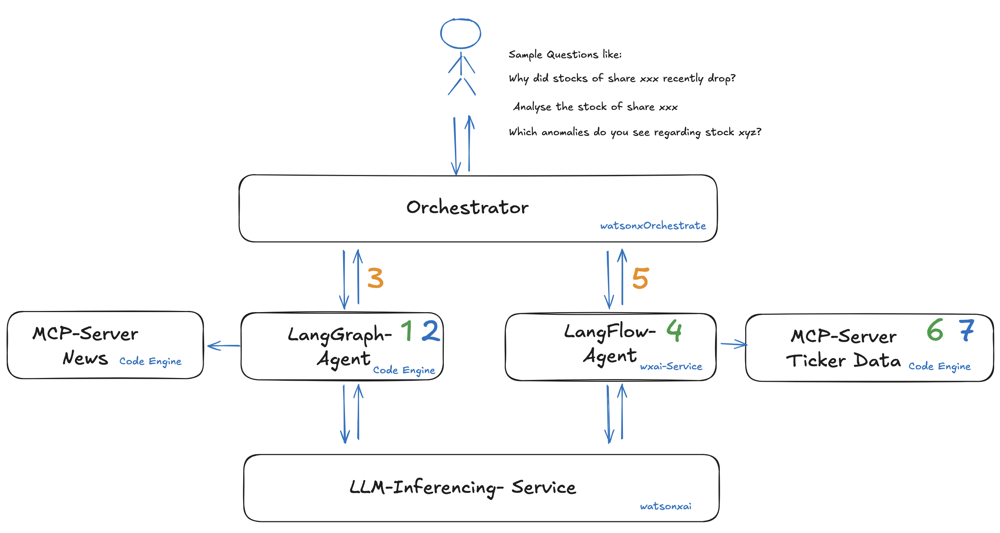

# Welcome to the GenAI Banking Meet-Up – Hackathon Edition

Welcome, and thank you for joining us for this special hackathon edition of the GenAI Banking Meet-Up. Over the course of this event, we’ll focus on exploring how generative AI can be applied to solve real-world challenges in the banking industry. This is an opportunity to not only experiment with new technology but also to build practical solutions that could drive innovation in your field.

### The Goal of the Hackathon

The main task for this hackathon is straightforward: **build your own intelligent agent.** Your agent should be accessible through a user interface, allow for direct interaction, and be capable of integrating with other agents to create a collaborative system. 

The possibilities are wide-ranging, but the focus is on creating tools that are practical and relevant to the financial sector. 

### What We Provide

To help you get started, we’ve prepared resources and guidance for building and deploying your agents. For example:

- **Pre-built agents:** You can work with two provided agents—one that delivers stock-related insights for end users and another that focuses on news-based analytics.
  
However, if you’d like to take a more customized approach, you also have the option to:
- Deploy your own **MCP servers**.
- Build your own agent tailored to your specific use case using tools like **LangGraph** or **LangFlow**.
- Register your agents with our **orchestration layer**, which allows them to collaborate with other agents.

### What’s Next?

Our aim is to give you both the tools and the flexibility to experiment. Whether you choose to work with the provided agents or create something entirely unique, this hackathon is about exploring the potential of generative AI in banking. By the end of the event, you’ll have built and deployed your own agent, ready to address relevant use cases in your field.

We look forward to seeing what you’ll create. Let’s make the most of this opportunity to learn, innovate, and collaborate. 

Good luck, and let’s get started! 

**Component Overview**

In designing this hackathon, we’ve considered the diverse needs of participants, ranging from those with deep technical expertise to hands-on professionals who are not necessarily code-first but are eager to explore AI-powered solutions. To accommodate these different profiles, we’ve introduced two approaches for implementing agents:

### Agent Implementation Options
1. **LangGraph-based agents:** Ideal for participants with a strong technical background who prefer a highly customizable and code-driven approach to building agents. LangGraph provides the flexibility to design complex workflows and interactions tailored to specific use cases.
   
2. **LangFlow-based agents:** A more accessible option for participants who prefer a visual, no-code or low-code interface. LangFlow simplifies the process of creating agents by offering a user-friendly design environment, making it easier to experiment and deploy solutions without extensive programming knowledge.

Both approaches allow agents to connect with the available MCP servers, which form the backbone of data access and functionality for this hackathon.

### MCP Servers
The MCP servers are specialized components designed to provide critical data and analytics capabilities to your agents. You can integrate these servers into your solutions to leverage their features:

1. **MCP Server News:**  
   This server provides access to the latest economic-related news using various tools. It is designed to offer comprehensive coverage and insights into financial and economic developments. For more details on its functionalities and technical specifications, refer to the chapter “MCP Server News.” (At the bottom of this Document)

2. **MCP Server Stock Data:**  
   Designed to deliver stock-related statistics, this server offers detailed data for any given stock. It can be utilized for generating insights, analyzing trends, or supporting decision-making processes. For a full description, see the chapter “MCP Server Stock Data.”

### Enterprise Context and Orchestration
As generative AI adoption grows within enterprise environments, different users from various business units or departments will begin developing and deploying their own agentic AI solutions. This creates a need for a **software layer** capable of managing these solutions efficiently.

This is where **watsonx.orchestrate** comes into play. By registering externally developed agentic AI solutions into the orchestration layer, watsonx.orchestrate can dynamically “pick” the most suitable agent for a specific user request. This ensures seamless integration and access to multiple solutions through a single unified interface. 

In practice, this orchestration layer becomes critical for enabling collaboration across business units while maintaining scalability and usability in enterprise settings.

---

By combining these components—LangGraph or LangFlow-based agents, MCP servers for data access, and watsonx.orchestrate for orchestration—you’ll have the tools to create robust, user-focused AI solutions tailored to real-world banking challenges.

# Documentation - Overview

For each of the elements shown in the architecture below, we provide documentation to 

a) a template to **build** a sample component (green number)

b) a way how to **deploy** this component in the target environment (blue number)

c) **integrate** the agent in the orchestrator layer (orange number)

**1 - Build a LangGraph Agent** - please refer to: `01_build_langgraph`

**2 - Deploy a LangGraph Agent** - please refer to: `02_deploy_langgraph`

**3 - Integrate LangGraph Agent to Orchestrate** - please refer to: `03_integrate_langgraph`

**4 - Build a LangFlow Agent** - please refer to: `04_build_langflow_agent`

**5 - Integrate LangFlow Agent to Orchestrate** - please refer to: `05_integrate_langflow`

**6 - Build an MCP Server** -  please refer to: `06_build_mcp_server`

**7 - Deploy MCP Server on Code Engine** - please refer to: `07_deploy_mcp_server`

## MCP Server News

---

### **cnbc\_news\_feed**

**Description**: Retrieves the latest breaking world news from sources like CNBC, BBC, and SCMP. Also includes the Federal Reserve's interest rate predictions from Fed Watch. Useful for getting a daily overview of global events and financial outlooks.

---

### **social\_media\_feed**

**Description**: Gathers trending stocks and investment opinions from social media platforms. Ideal for understanding investor sentiment and what topics are currently being discussed in the markets.

---

### **get\_ticker\_news\_tool**

**Description**: Fetches financial news related to a specific stock ticker from Yahoo Finance. Particularly helpful for in-depth research and staying updated on a company's latest developments.

---

### **get\_current\_time**

**Description**: Provides the current time in ISO 8601 format. Useful for timestamping or synchronizing events and data.

---

## MCP Server Stock Data

### **get\_financial\_statements**

**Description**: Retrieves financial statements for a given company. Supports **income**, **balance sheet**, and **cash flow** statements with options for **quarterly** or **annual** reporting. Useful for financial analysis and valuation.

---

### **get\_overall\_sentiment\_tool**

**Description**: Provides a snapshot of overall market sentiment by combining:

* CNN Fear & Greed Index (score and rating)
* Market RSI (Relative Strength Index)
* VIX (Volatility Index)
  Great for gauging investor mood and potential market direction.

---

### **get\_price\_history**

**Description**: Fetches historical price data and a digest including:

* OHLCV (Open, High, Low, Close, Volume)
* Technical indicators (via TA-Lib)
* Risk metrics and other quantitative insights
  Suitable for both short- and long-term backtesting or market analysis.

---

### **analyze\_fng\_trend**

**Description**: Analyzes the trend of the CNN Fear & Greed Index over a specified number of days. Returns key metrics such as:

* Latest value
* Average over the period
* Trend direction
* Total data points used
  Useful for spotting emotional shifts in the market over time.

---

### **get\_current\_time**

**Description**: Returns the current time in ISO 8601 format. Handy for logging or time-based operations.

---
