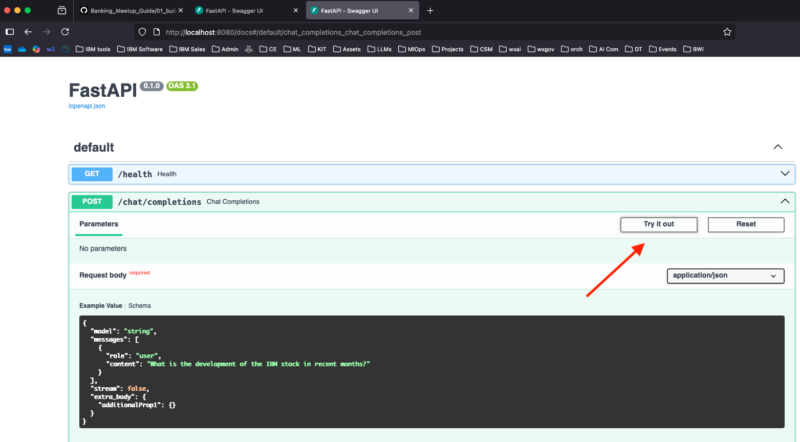

# 🧠 MCP Banking Agent (FastAPI + watsonx + MCP) – Docker Deployment

This project contains a simple **LangGraph React Agent** integrated into a **FastAPI-based backend** built using **IBM watsonx** and **LangGraph MCP tools**. It answers financial queries such as **“Summarize the latest news regarding the stock market”** and is designed to be deployed in **IBM Code Engine** or run locally using **Docker**.

---

## 📦 Features

- Integrates IBM watsonx LLMs with an external MCP server containing tools for financial analysis.
- Supports both **streaming** and **non-streaming** responses.
- Compatible with watsonx Orchestrate as an external agent.
- Designed for Docker-based deployment.

---

## 🔧 Prerequisites

- [Docker](https://www.docker.com/)
- IBM watsonx project and credentials
- `.env` file with proper environment variables

---


---

## 📄 Step 1: Create `.env` File

Make a `.env` file in the root of your project:

```env
WX_MODEL_ID=mistralai/mistral-large
WX_URL=https://eu-de.ml.cloud.ibm.com
WX_PROJECT_ID=<your_project_id>
WX_API_KEY=<your_wx_api>
MCP_SERVER_URL=https://news-mcp.1x378ktkz0ug.us-east.codeengine.appdomain.cloud
```

## Step 2: Build the Docker Image
```
docker build -t my-fastapi-agent .   
```

## Step 3: Run the Docker Container
```
docker run -p 8080:8080 my-fastapi-agent
```


## Step 4: [Optional]

go to: 
```
localhost:8080/docs
```

and try the chat/completions endpoint. Click on `Try it out`. 

  

Then copy the following snippet and click on `Execute`.
```
{
  "model": "string",
  "messages": [
    {
      "role": "user",
      "content": "Summarize the latest news regarding the stock market."
    }
  ],
  "stream": false,
  "extra_body": {
    "additionalProp1": {}
  }
}
```

You can also try some other example questions that are listed below.


**Example Questions:**
```
- What are the latest news on Tesla?
- What is the development of the IBM stock in recent months?
- What are the latest news on social media for financial markets?
- What are the current news?
```


Monitoring the output of the Docker container, you can see the various tools hosted on the MCP server that are used by agent such as `social_media_feed`, `get_ticker_news_tool` or `cnbc_news_feed`.
