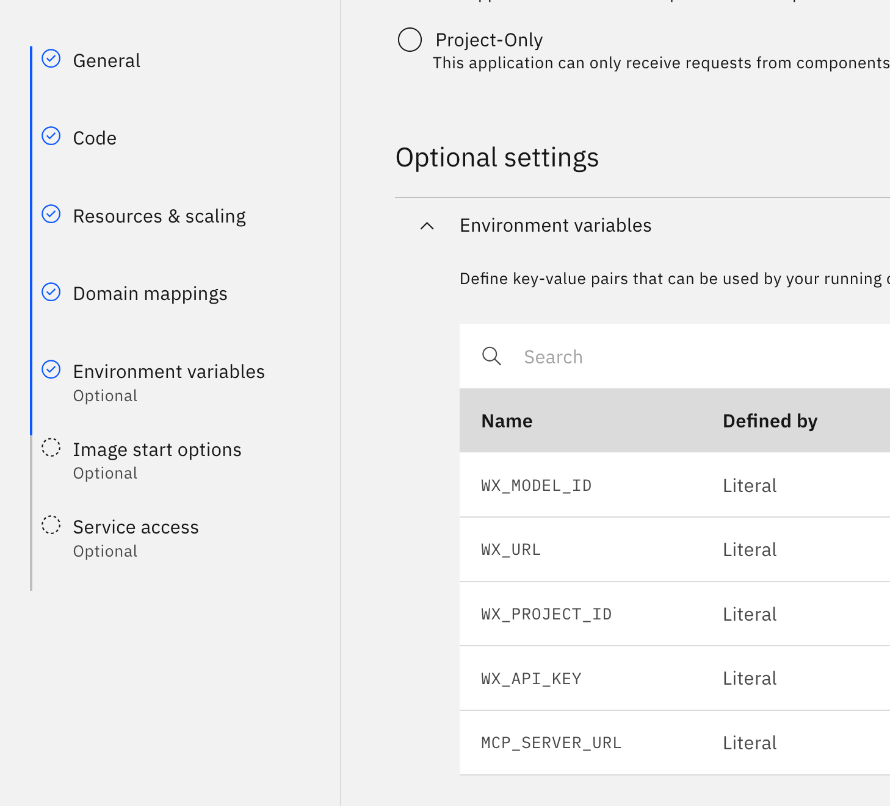

## Set up an LangGraph on Code Engine (via the UI)

Log in to the IBM-Cloud. Ensure that you are logged in to the right cloud account (top right), and click on "Resource list" (left bar):


Go to Containers and click on langgraph-agents:


Scroll down, and click on Click on `Applications` and then `Create`. Give it a name of your choice (using your initials is a good best practice):


We are going to build a container image from source. If you want to deploy the template, follow these steps: [minor adjustments are needed if you deploy from a different repo]:


# Update TODO
1. Enter the github URL: https://github.ibm.com/Hendrik-Loeffel/Banking_Meetup_Guide.git

2. Add the ssh key called `ssh-secret-h` which grants access to the github repo. 

3. set the Build context to: 01_build_langgraph/ 

4. Give the image a name, for instance "langgraph-agent-your-initals"

Click two times on "Next" to finish the build details. Do not click on "Create" yet!

Next, we need to set the following environment variables via the UI:

```
WX_MODEL_ID=mistralai/mistral-large

WX_URL=https://eu-de.ml.cloud.ibm.com

WX_PROJECT_ID=6e19db91-8059-4ccb-ab24-ad664564e391

WX_API_KEY=<your_wx_api>

MCP_SERVER_URL=https://news-mcp.1x378ktkz0ug.us-east.codeengine.appdomain.cloud
```

 [in a real world scenario, we would not expose an API-key as an environment variable; instead, this would be set via a secret. We skip this here for brevity]





That's it. Click create at the right side of the screen. The deployment will take 3-5 minutes.

On the `Overview` page, under `Applications`, click on the application you just created. Click on `Open URL` and append a `/docs` in the browser - fastapi exposes under this route by default a swagger UI with which you can play around. 

You can try the endpoint /chat/completions with the following snippet:

```
{
  "model": "string",
  "messages": [
    {
      "role": "user",
      "content": "Summarize the latest news regarding the stock market."
    }
  ],
  "stream": false,
  "extra_body": {
    "additionalProp1": {}
  }
}
```
