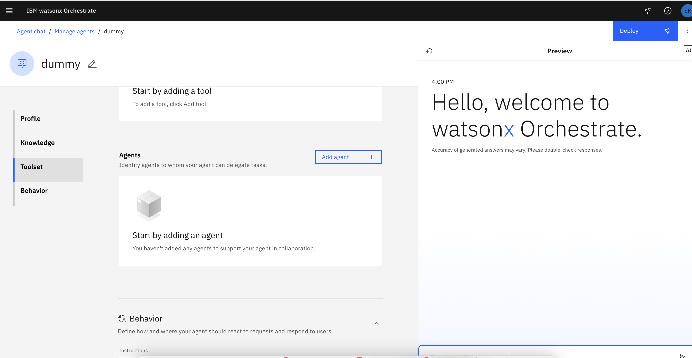

# Project Overview

This project showcases how to integrate a LangGraph Agent deployed on Code Engine as an external agent in IBM Watsonx Orchestrate. 

---

### Architecture Overview

The project consists of the following components:

#### 🧠 **MCP Server**  
A modular tool server designed to expose financial and analytical tools through the MCP protocol. It supports streamable HTTP as a transport protocol, ensuring smooth and efficient communication. The MCP Server provides the backend functionality necessary for tool execution.  

**Server URL:**  
[mcp-server](https://news-mcp.1x378ktkz0ug.us-east.codeengine.appdomain.cloud)

---

#### 🔗 **LangGraph-Agent**  
A LangGraph-based agent client, built using **FastAPI**, that can invoke remote tools hosted by the MCP Server and perform reasoning tasks with **IBM watsonx.ai**. The client acts as the intermediary between the tools and Watsonx Orchestrate, enabling intelligent task execution.  

**LangGraph Client and Documentation:**  
[langGraph-Agent](https://langgraph-sample-agent.1x3ojl77retr.eu-de.codeengine.appdomain.cloud/docs)

---

#### 🚀 **Deployment**  
Both the MCP Server and LangGraph Client are containerized, ensuring portability and scalability, and deployed using **IBM Code Engine**. This deployment model allows for seamless integration into cloud environments with minimal overhead.

---

#### 🤝 **Orchestrate Integration**  
In the following, we will configure the LangGraph Agent as an external agent within **IBM Watsonx Orchestrate**. It receives task context from Watsonx Orchestrate and responds intelligently by invoking the appropriate tools via the MCP Server. This setup enables automated and efficient task handling in enterprise workflows.

---

This project demonstrates the power of modular AI architectures and cloud-native deployments, providing a robust framework for integrating intelligent agents into real-world applications.

### Register the New Endpoint as an External Agent

To integrate the MCP Client as an external agent with IBM Watsonx Orchestrate, follow these steps to create and configure an agent that exposes a chat streaming endpoint. This endpoint will emit responses to user queries in real-time.

- Navigate to the [ibm cloud](https://cloud.ibm.com/) and login with your IBMID.
- Ensure that you are in the right cloud account (`2709027 - watsonx-events`)
- Click on the Burger Menu  (top left) and click on `Resource List`.

  

- Open the AI / Machine Learning pane and click on the watsonx Orchestrate instance. 

  

- Click on `Launch Watsonx Orchestrate`
- Navigate via the top-left burger menue to `Build` and on `Agent Builder`
  

- You will see multiple pre-deployed agents. Please approach us  regarding which agent to use. We will give them out on first-come-first save basis.

**When you have your agent assigned, follow the next steps:** 

---

#### 2. Add a Sub-Agent  
After creating the Master Agent, scroll down to the section where you can add sub-agents.  

 

---

#### 2. Import an External Agent  
Click on **Add Agent**, **Import** and proceed by selecting **Next**.  

---

#### 3. Choose "External Agent"  
In the next step, choose the option **External Agent**. In this step, we will add the LangGraph based Agent that is deployed on Code Engine.

 

---

#### 7. Enter the Agent Details  
Fill in the required fields to configure your external agent:

- **Provider:** "External agent"
- **Display name:** Within one watsonx Orchestrate tenant, names of agents must be unique. Therefore, add your initials to the agent name. For example, *News_Agent_LB*.  
- **Description of agent capabilities:** Provide a brief description of the agent’s capabilities, such as "*This agent can retrieve current news*".  
- **API Key:** You can just enter a dummy value here, since we have not implemented any API key check for our LangGraph agent.
- **Service Instance URL:** Use the Test URL of the deployed agent with `/chat/completions` appended (e.g. `https://langgraph-sample-agent.1x3ojl77retr.eu-de.codeengine.appdomain.cloud/chat/completions`)

 

---

#### 8. Test the Connection  
Once the agent is registered, you can test its functionality by typing a question in the chat window. The agent should respond intelligently based on the configured tools and data sources. You can reset the chat by using the circular arrow on the upper left hand corner of the chat window. 

 

---

#### 9. Deploy the Agent
By clicking on `Deploy`, you can deploy your agent the Agent Chat. This will take a moment. When the green box appears, you can click on `Agent chat` and test your agent in the watsonx Orchestrate Chat UI.

#### 10. Chat with your Agent

Make sure to select the right agent.

By completing these steps, your external agent will be successfully registered and ready to handle user queries within the Watsonx Orchestrate environment. This setup allows for seamless integration and real-time interactions powered by the deployed MCP Client.