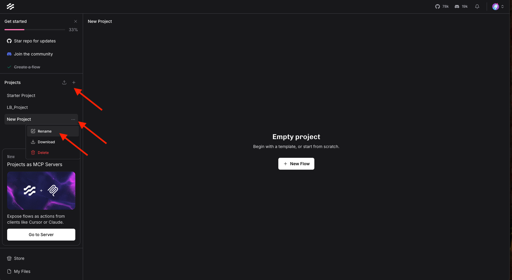

## How to Set up a Langflow Agent


### Create your first flow
1. Go to our [Langflow Environment](https://langflow.1x32cqxa0gmi.us-south.codeengine.appdomain.cloud/flows)

2. Make sure to create a new project with your initials, e.g. `LB_Project`. We are going to work on a shared instance, therefore everybody should create its own projects to not disturb each other. Click on `+` to create a new project, then on the three dots `...`, and `Rename`. This way, you can set the name of your project.



3. Click on `New Flow` on the top right of your page:


4. Give it a unique name (this is a shared instance - we will have a lot of flows at the end of our workshop, so investing some creativity would definitely help!;) ) 

5. On the top, click on `Import` and import the `agentic_advisor.json` file.


Well done! You have successfully imported your first flow:


One thing is missing: You need to insert an `API-key` and adapt the `watsonx Project ID` in the watsonx.ai component. For this, please approach one of our instructors. They will show you how to get one. Upon retrieval, insert the API key in the watsonx.ai component:


You can click now on "Playground" on the top right and experiment with your flow. Feel free to adjust your flow, add new components, and build something on your own!


For testing the capabilities of your agent, you can play around with some of the following example questions:

```
- TSLA stock value past 3 months
- How has Tesla stock evolved in the last year?
- what is the latest news on IBM?
- How is the fear and greed index developing over the last 7 days?
- Give me an overview on the financial statement of IBM
- Show me a summary on Microsoft
- Show me the price history for Apple for the last 10 years
- Financial statement for Alphabet
```

</br>

---

You can also play around with different LLMs in the watsonx.ai component within Langflow.

Suggested models are:
- mistralai/mistral-large
- meta-llama/llama-3-3-70b-instruct
- meta-llama/llama-3-2-90b-vision
- meta-llama/llama-4-maverick-17b
