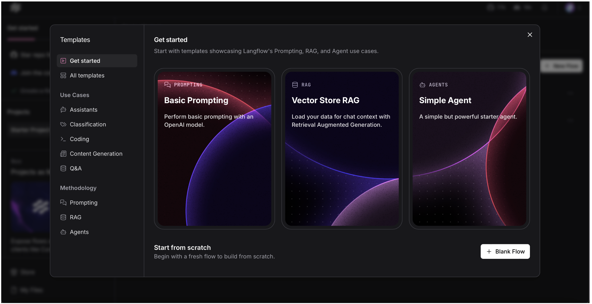
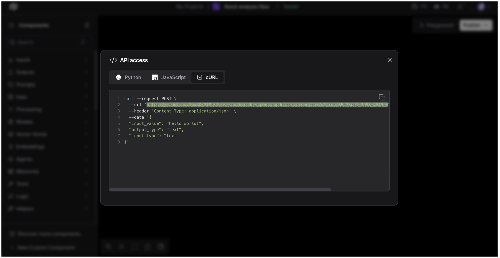
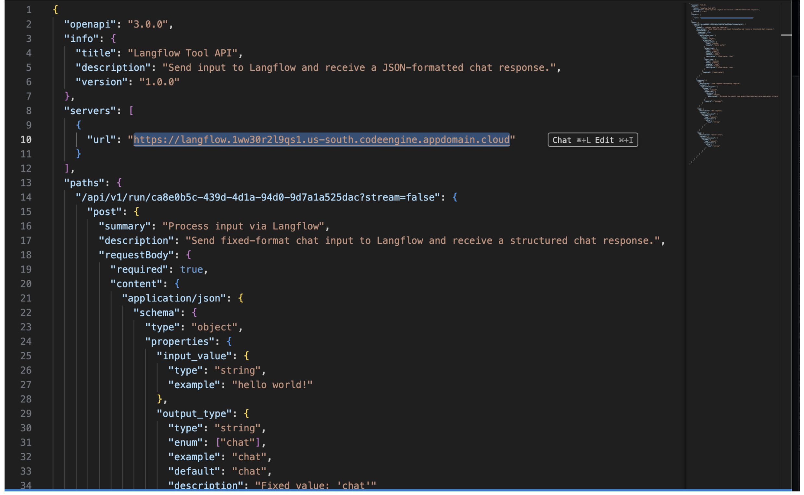
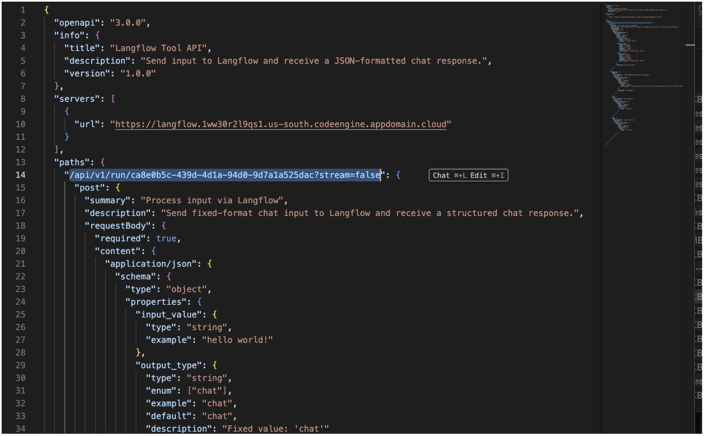
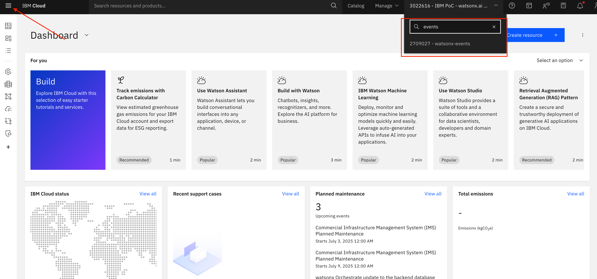
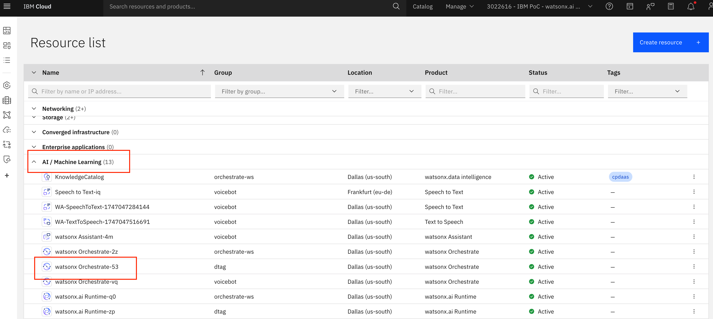
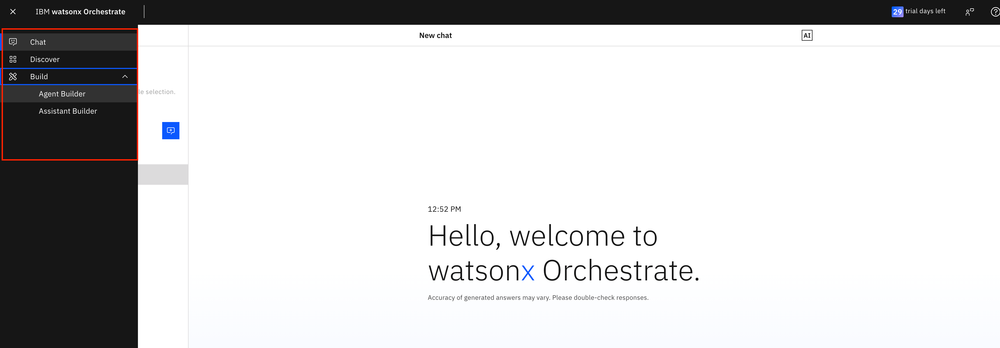
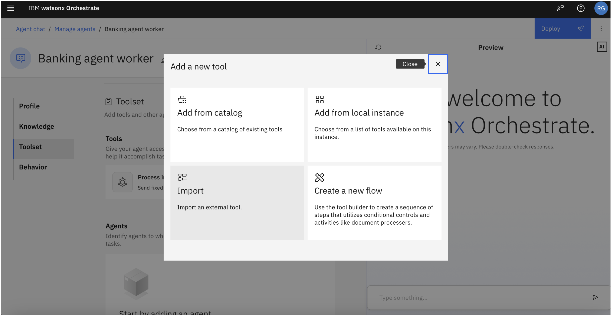
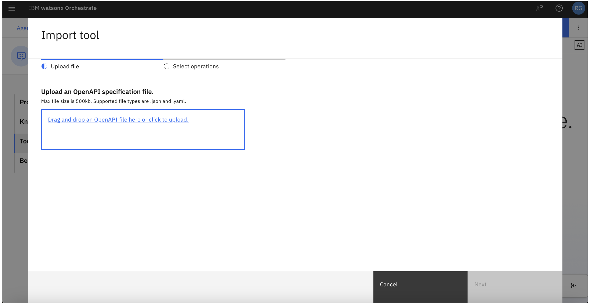

# Langflow Integration With IBM Watsonx Orchestrate

This document provides a step-by-step guide to integrate a Langflow-generated Agent (API) with IBM Watsonx Orchestrate. By following the instructions, users will be able to import a saved Langflow flow, and configure it to be used by an Agent deployed in Watsonx Orchestrate.

---

## Step 1: Login to Langflow

- Navigate to the Langflow instance for this bootcamp: [Langflow Environment](https://langflow.1x32cqxa0gmi.us-south.codeengine.appdomain.cloud/flows)
- This will redirect you directly to the dashboard.

  

---

## Step 2: Create and Import Flow

- On the Langflow dashboard, click **"Create New Flow"** to start a fresh project.
- You can either develop the flow yourself or import an already developed flow.
- You can also reuse the flow that you build in the previous task (`04_build_langflow_agent`)

---

## Step 3: Validate and Publish the Flow

- After importing the flow, review it to ensure all nodes and settings are correct.
- Test your flow with the `Playground`
- Once validated successfully, click **"Publish"** for **"API access"**.
- Click on **"cURL"**
- After publishing, Langflow will generate an **API Endpoint URL** — make sure to copy this URL for the next steps.

  

---

## Step 4: Update API Endpoint in Watsonx Orchestrate OpenAPI file

- Open the OpenAPI file which will be imported into Watsonx Orchestrate. The file is called `"open-api-langflow-config.json"` and is also included in this repository.
- Replace the existing API Endpoint with the newly generated URL from Langflow. You will need to split the **URL that you copied into the base URL as well as the path component**.
- Make sure to **save** the configuration after updating.

> **Note:** A sample configuration file is attached to this documentation. Please ensure you overwrite only `url` and `paths` section of the OpenAPI file.

---

## Step 5: Create Worker (Service) Agent in Watsonx Orchestrate

- Navigate to the [ibm cloud](https://cloud.ibm.com/) and login with your IBMID.
- Ensure that you are in the right cloud account (`2709027 - watsonx-events`)
- Click on the Burger Menu  (top left) and click on `Resource List`.

  

- Open the AI / Machine Learning pane and click on the watsonx Orchestrate instance. 

  

- Click on `Launch Watsonx Orchestrate`
- Navigate via the top-left burger menue to `Build` and on `Agent Builder`
  

- You will see multiple pre-deployed agents. Please approach us  regarding which agent to use. We will give them out on first-come-first save basis.

- When you have your agent assigned, follow the next steps: 

- In the agent configuration, under the **Tools** section, click on `**Add Tool**`. 
  
  

- Click on `Import`. Upload the OpenAPI file that you created in the previous section. Select the action in the next window and click on `Done`. 

  
  

- Using the `...`next to the tool, you can also edit the tool and adpat the description.

Now you can test your agent directly in the test UI or you can `Deploy` it.

---

## Conclusion

You have now successfully:

- Imported and published a Langflow flow.
- Acquired and updated the OpenAPI file.
- Integrated the Langflow agent into Watsonx Orchestrate.

This configuration enables modular, flow-based AI services powered by Langflow to be triggered by Watsonx Orchestrate agents, allowing for scalable automation and orchestration of tasks.
