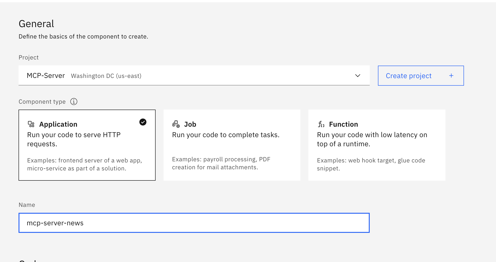
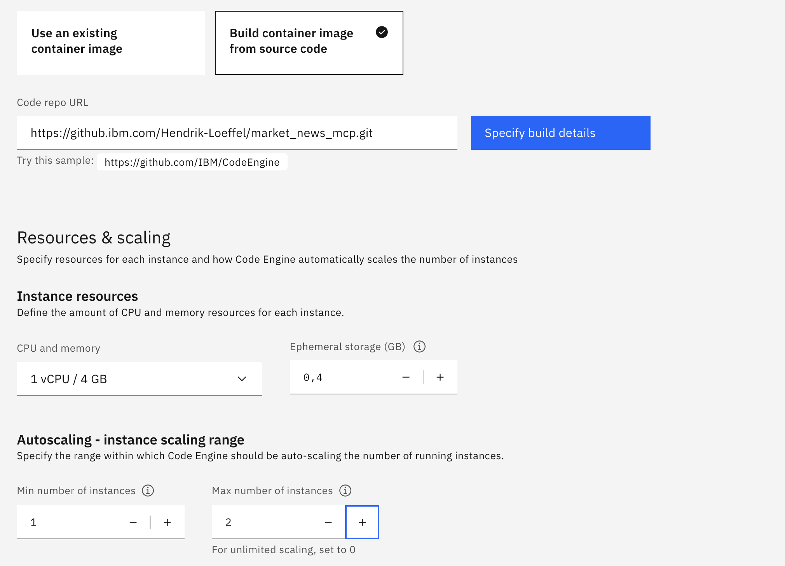
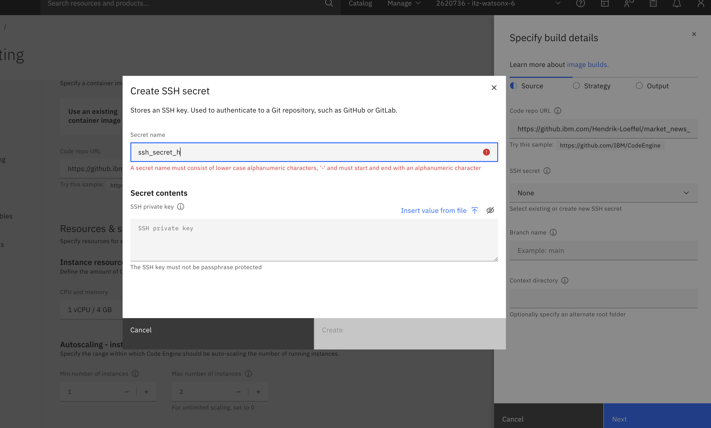
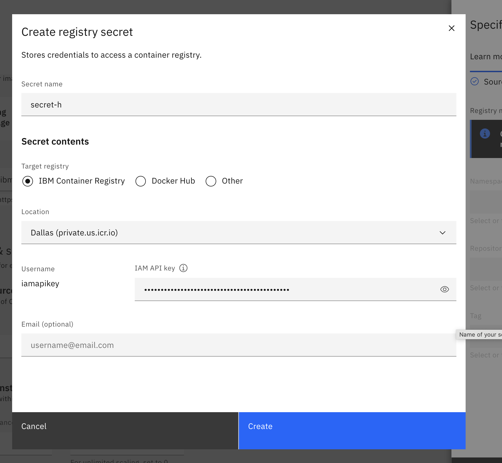

## Set up an MCP-Server on Code Engine (via the UI)

Log in to the IBM-Cloud. Ensure that you are logged in to the right cloud account (top right), and click on "Resource list" (left bar):

Click on "Create Resource" if you haven't requested a Code Engine instance in your IBM Cloud account yet, and search for:

Click on "Start Creating". Then, create a new project. Call it "MCP-Server". Choose "Application" as your component type:

We are going to build a container image from source. If you have developped your own MCP server, don't forget to add your ssh-credentials if needed to allow Code Engine to access your machine. A sample Dockerfile can be found in './06_build_mcp_server'

Configure your Resources & scaling as needed (this depends on your fastmcp configuration). The numbers provided should be sufficient to start a simple mcp server:

Click on "Specify Build details". Add a ssh-secret (private key) - the public key must be stored within your github account and give access to the github repo from which you want to get the source files.

Then, click next two times. A Build resource size M should be sufficient. Now, you are prompted to add your API key. This allows Code Engine to store the built image in the IBM container registry. Go to "Manage" (top right) and choose "Access", then click on "API Keys". Insert the key in your Code Engine tab:

Remark: If you want to follow the CLI-approach, please refer to this community link: 

https://community.ibm.com/community/user/blogs/jeremias-werner/2025/04/30/code-engine-mcp-server
